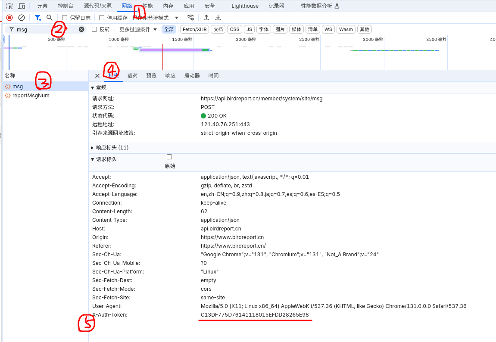

# commonBird
`commonBird`是一款旨在互通[中国观鸟记录中心](https://www.birdreport.cn/)和[eBird](https://ebird.org)两款国内鸟人常用软件的小工具，在[qBird](https://github.com/TaQini/qBird)的基础之上改进而来。

## 预计支持的功能
 - [x] 观鸟记录中心记录一键转换eBird导入文件
 - [ ] eBird记录转换观鸟记录中心记录
 - [ ] 打包成为exe
 - [ ] 还没想好
 
## FQA
- 环境要求
    - 需要具备`node`和`python`环境
    - 执行`npm i`安装 javascript 依赖项
    - 执行`pip install -r requirements.txt`安装 python 依赖项

- 如何使用
    - 执行`python main.py`即可运行

- 如何获取观鸟记录中心的认证 Token
    - 打开观鸟记录中心[用户中心](birdreport.cn/member)
    - 按下`f12`键打开开发工具`DevTools`
    - 点击上方选项卡`网络`(`Network`)并刷新页面
    - 搜索`msg`并点击其中一个搜索结果
    - 点击选项卡`标头`(`Header`)，一般来说默认就是这个选项卡
    - 复制`X-Auth-Token`的内容填入即可
    - 

## 欢迎鸟友们一起开发
 - 快来 Fork + Star！

 - My ebird profile URL: https://ebird.org/profile/NDcyMjc0Ng

 - 观鸟中心 ID: ckrainbow

